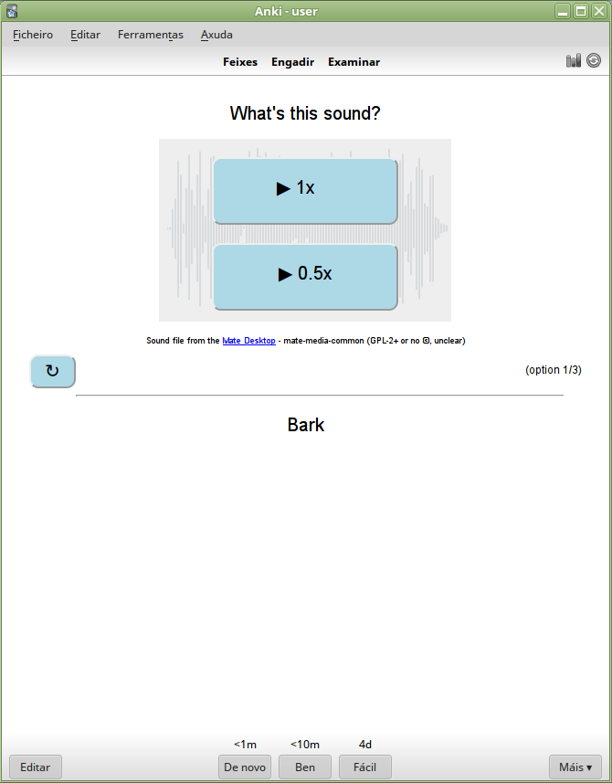
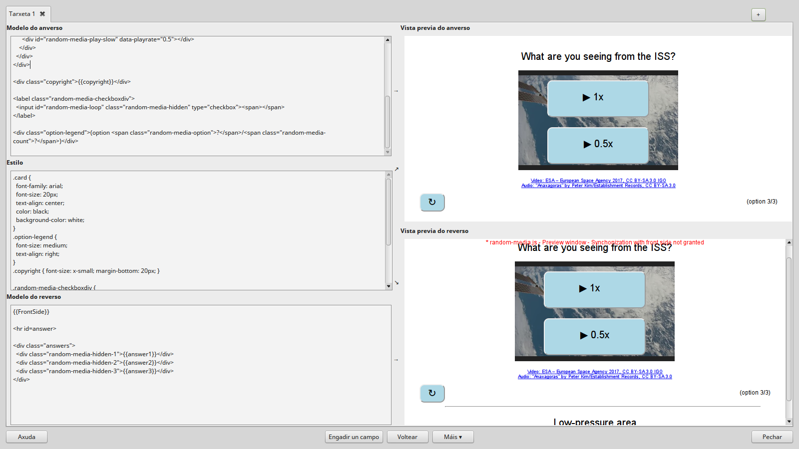
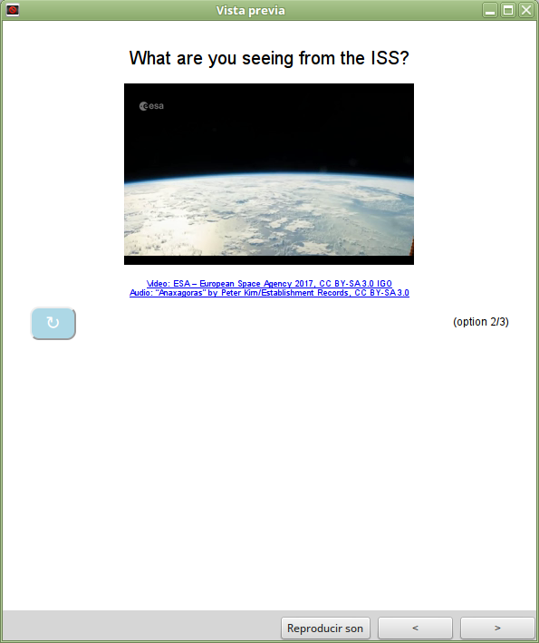
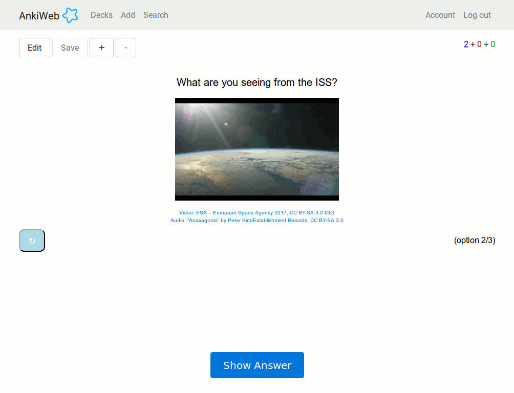

# anki-purejs-media-random

A pure-javascript implementation -- needing no plugins, hence portable to
several (ideally all) [Anki](https://apps.ankiweb.net/) clients -- of a
feature-full HTML embedded-in-card media player, together with a multable
card template allowing the random selection of one of its variants while
reviewing.


## Overview

This is a proof-of-concept deck you're supposed to use as a basis to build
your own. I provide the deck in several formats.

First and foremost, as an `anki2` file, the native format used by Anki.
The file should include everything that's needed to start adapting it
to your needs.

The deck is also available as a shared deck in Anki's cloud
[here](https://ankiweb.net/shared/info/414965785).

Apart from that, I provide all the files I've used to build the deck.
Inside the `collections.media` folder is the heart of this idea:
`_random-media.js` and `_random-media.css`. These two should be included in
the template of your cards, together with a few more things. Your notes should
also hold some `bookmarking` information for this to work.

Another file you'll probably want to check if you intend to include your own
videos, as you should, is the conversion script `webm-convert.sh`, as the
formats you can include are more limited than usual.

Please take into account this is in alpha status yet. Expect some rough edges,
specially when editing your card templates. I've included a small section on
that at the end.

The deck was tested with Anki Desktop 2.0 on Linux, with Ankidroid 2.8 and
with recent versions of Firefox and Chromium running Ankiweb on a tab.


### Features

There are two main selling points for this deck (apart from being free ;-).


#### Embedded HTML player

The first selling point is the inclusion of an embedded HTML player inside
your cards.

Anki already does a decent job when dealing with media files. But when we
want to get fancy, we find ourselves too limited by it. To implement the
features I wanted, embedding an HTML + javascript-powered player was the best
and most portable approach:

  - Desktop

   
   
   

  - Ankidroid

   

  - Ankiweb

   

We can see how it's possible to:

  - Include video and audio files indistinctly.
  - Replay the media with an on-card button.
  - Replay the media at a slower speed with another on-card button.
  - Loop indefinitely the file at any of both speeds.
  - Flip the card while the media keeps playing with the same parameters
   (disclaimer: expect a minor cut when doing so).


#### Randomization of cards

The other strong point of this deck is the randomization of *context*
when testing your memory against *a single fact*, to decouple the thing
you really try to memorize from the circumstances surrounding it.

The idea is not really new. There are lots of different variations on this
same idea out there:

  - [One example](https://yingtongli.me/blog/2015/03/15/random-question-generator-on-anki-using.html).

But the thing is, here it's applied successfully to media files as well, so
the possibilities of the HTML player can give a really nice experience.

With both features, it's possible to implement cards in the same fashion
as those from, say, [Delvinlanguage](http://delvinlanguage.com/).

This randomization feature is more or less decoupled, in the sense that
you could use the exact same javascript and css files without the need
to really include media files, to construct a text-only deck with
randomization, for instance.


## Rationale

Inspired by services like [Delvinlanguage](http://delvinlanguage.com/),
[Mainingu](https://mainingu.com) or [Supernative](https://supernative.tv/),
I wanted to implement the same kind of functionality on the SRS flashcard
ecosystem of [Anki](https://apps.ankiweb.net/).
In order to be on pair, feature wise, with those services there are a series
of obstacles we need to solve.

For starters, Anki clients, like the desktop one or Ankidroid, resort to
external, platform-dependent players to relay them the task of playing media
files, even though cards in Anki clients are rendered on an embedded webviewer
component that, potentially, can handle them. Actually, relying on dedicated
media players is not a bad choice: a lot more media formats can be reliably
included in decks that with your run-of-the-mill webviewer; and for a vast
category of audio-based cards it makes more sense to keep working that way.

But if we want to give the users some goodies, like a fast UI to modify the
speed at which the reproduction should run or asking it to loop indefinitely,
or even to be able to jump to the "backside" of the card without cutting the
audio or video that was playing, we need more tools than what Anki provides.

As we aim for feature parity, another difficulty lies it the way the SRS
systems of Delvinlanguage and company work: on of the things offered is a
unified way to treat a sole `fact` (the thing we want to test our memory
against, for the most efficient use of SRS systems it's better if there's only
*one* of these `facts` on each card) as a unit, scheduling it as such, and
yet render the card on a random way to avoid potentially harmful associations
of the fact with the context of the card. Delvinlanguage, for instance, tests
each word with one randomly chosen video (which includes the word) from their
database, on a [cloze-delete](https://en.wikipedia.org/wiki/Cloze_test)
fashion.

That way, you don't have several cards for the same word, avoiding the
undesirable effect of them interfering with each other's schedules
but, at the same time, you've got yourself dynamical card context.

A final consideration is that all of this could most likely be implemented
as a extension (or plug-in, or add-on, I'm not sure the terminology is
homogeneous across all clients), for instance with python for the desktop,
with Android companion applications for Ankidroid, and so on. But it'd be
a nightmare to build and maintain if we want to support all platforms,
and some of them (e.g. Ankiweb) don't support extensions at all... at least
if we don't stretch too much the meaning, since a browser running an instance
of Ankiweb supports javascript or general-purpose browser extensions.


## How to construct this deck

The first thing we should take into account is the audio and video formats
to which we are limited if we want to support a big portion of the Anki
clients.  For that, after some tests, for video files I've chosen the
[`webm`](https://en.wikipedia.org/wiki/WebM) format with codecs `VP9` for
the video streams and `Opus` for the audio streams; for audio-only media I'm
currently going with the [`ogg`](https://en.wikipedia.org/wiki/Ogg) /
[`vorbis`](https://en.wikipedia.org/wiki/Vorbis) combo, but `mp3` should be
safe too (with the added bonus of being previewable in the cloud's portfolio
of shared decks, which `ogg` is not, at present).

There's just one little gotcha, though: `webm` is not among the formats
"natively" recognized by Anki 2.0, so adding those files to your decks through
the GUI requires knowing how to workaround this. It's really no big deal
and I hope it gets corrected imminently when Anki 2.1 gets out -it's in RC2
as of this writing-. If you're deck is private, so you know beforehand which
devices are going to be used, you could resort to other formats like `mp4`.

Another consideration is that we need to define some *artifacts* in our
notes and templates to make them work correctly with this software.
For instance, we'll keep fields containing references to the media files in
the usual *Ankian* way; but at the same time, due to some idiosyncrasies in
the way Anki treats this kind of fields, we'll need to include in *sister
fields* the exact same name of the file, but naked: i.e. if a *normal*
media field contains `[audio:hello.ogg]`, we'll have to have an adjacent
field whose content will be simply `hello.ogg`.

Actually, we aren't going to use the *normal* media fields anywhere in our
templates: the reason we need them in the card is just so we can make
Anki still understand those files are being used by the cards, because the
*naked* ones aren't the hint it's looking for, so they won't get correctly
processed when synchronizing or checking the collection if we leave them
out.


### Generating the media files

I've included the script `web-convert.sh` as an example of how to make the
conversion of files. It uses [`ffmpeg`](https://en.wikipedia.org/wiki/FFmpeg)
with [`libvpx`](https://en.wikipedia.org/wiki/Libvpx) and
[`libopus`](https://en.wikipedia.org/wiki/Opus_%28audio_format%29). Explaining
how to install them all is outside the scope of this guide, but most Linux
distributions include them already installed or give easy means to do it;
`brew` for MacOS X should be on par, and I don't think it'd really that hard
on Windows.

Ideally you should read that `bash` script and adapt it to your needs. For
example, adding audio to the resulting files is explained in commens there.

For audio, `mp3` or `ogg` are pervasive formats which lots of programs can
produce and they should work out of the box for most clients.


### Filling the notes

As explained before, we'll need some extra fields to get this working.

Let's see one of our cards:

<table>
    <tbody>
        <tr><td><b>card_id</b></td><td>00002</td></tr>
        <tr><td><b>options</b></td><td>3</td></tr>
        <tr><td><b>question</b></td><td>What are you seeing from the ISS?</td></tr>
        <tr><td><b>media1</b></td><td>[audio:00002-1.webm]</td></tr>
        <tr><td><b>media1fn</b></td><td>00002-1.webm</td></tr>
        <tr><td><b>answer1</b></td><td>Aurora Borealis</td></tr>
        <tr><td><b>media2</b></td><td>[audio:00002-2.webm]</td></tr>
        <tr><td><b>media2fn</b></td><td>00002-2.webm</td></tr>
        <tr><td><b>answer2</b></td><td>Sunrise</td></tr>
        <tr><td><b>media3</b></td><td>[audio:00002-3.webm]</td></tr>
        <tr><td><b>media3fn</b></td><td>00002-3.webm</td></tr>
        <tr><td><b>answer3</b></td><td>Low-pressure area</td></tr>
        <tr><td><b>copyright</b></td><td>
          Video: ESA – European Space Agency 2017, CC BY-SA 3.0 IGO</br>
          Audio: “Anaxagoras” by Peter Kirn/Establishment Records, CC BY-SA 3.0
        </td></tr>
    </tbody>
</table>

I recommend always having a sort of `card_id`, unique for each card, preferably
numerical and sequential. But it's not really required for this software to
work.

Unless all your notes have the same number of "variants" or "options", we'll
need a field holding this number for each note (otherwise we could put the
constant number directly on the template). Here it is named `options`.

Then you'll have a number of fields that would be the same as with any regular
type of note... But some of them will come in groups of size `options`. In
general, on a single card, you'll probably want only fields without group
(the loners) and fields coming in `options` packages.

The task of the javascript is to choose one number from 1 to `options` and
for each group of fields show only the one corresponding to that field.
The numbers or names of the fields are not really important here. The real
place where the groups are set in stone is in the HTML template. But it's
highly recommended to keep a congruent naming system for the groups.


### Filling the templates

Let's see the example templates included with the note type `Random Media`
in the deck, and then we'll start explaining them from bottom to top.

Front:
```html
<!-- --><script src="_random-media.js" random-media-count="{{options}}"></script><!-- -->
<link rel="stylesheet" type="text/css" href="_random-media.css" />

<div class="question">{{question}}</div>

<div id="random-media">
  <div class="random-media-container">
    <video class="random-media-hidden-1" data-src="{{media1fn}}" preload="none"></video>
    <video class="random-media-hidden-2" data-src="{{media2fn}}" preload="none"></video>
    <video class="random-media-hidden-3" data-src="{{media3fn}}" preload="none"></video>

    <div id="random-media-play-controls" class="random-media-hidden">
      <div id="random-media-play"></div>
      <div id="random-media-play-slow" data-playrate="0.5"></div>
    </div>
  </div>
</div>

<div class="copyright">{{copyright}}</div>

<label class="random-media-checkboxdiv">
  <input id="random-media-loop" class="random-media-hidden" type="checkbox"><span></span>
</label>

<div class="option-legend">(option <span class="random-media-option">?</span>/<span class="random-media-count">?</span>)</div>
```

Stylesheet:
```css
.card {
  font-family: arial;
  font-size: 20px;
  text-align: center;
  color: black;
  background-color: white;
}
.option-legend {
  font-size: medium;
  text-align: right;
}
.copyright { font-size: x-small; margin-bottom: 20px; }

.random-media-checkboxdiv {
  position: relative;
  top: -10px;
  float: left;
  border-radius: 10px;
  padding: 5px 15px;
}
```

Back:
```html
{{FrontSide}}

<hr id=answer>

<div class="answers">
  <div class="random-media-hidden-1">{{answer1}}</div>
  <div class="random-media-hidden-2">{{answer2}}</div>
  <div class="random-media-hidden-3">{{answer3}}</div>
</div>
```

The `backside` is nothing that special. As you can see, it just includes the
frontside and then, instead of the regular answer a usual card would have,
we include all of them. The magic here is in defining them with
`class="random-media-hidden-?"`, with `?` being a number from 1 to `options`,
so the javascript and the css know they have to hide them all except for the
chosen one. The number given here to the class is of utmost importance: is
the one that should match the `option` randomly chosen by the javascript.

The card could also have been designed to have a single answer (but multiple
options on the frontside), in which case you wouldn't have to assign it any
of these classes.

The `stylesheet` is also nothing special. This one has some simple definitions
for the card, plus a tweak for the `.random-media-checkboxdiv` to adapt it
better for this card layout. Most of the heavylifting is done in
`_random-media.css` for you, but in this way you can tweak the style of this
software's components without having to open the css file itself.

Now, on the `frontside` is where things start to get interesting and hairy.
The first two lines are the ones that launch all the Random Media system
into your cards. There are more things to note here than it could be apparent
at first sight.


#### Workarounding Anki Desktop

An advice: whenever you're about to edit the templates, start always by
putting a character, like a space, in the middle of the first `-->` you
can see on the frontside. Whenever you're done with the edit, erase the
extra character again. Or else Anki will make you sad ;-).

Now you've been warned, here's the technical explanation:

The first line includes two HTML *commentaries*, started by `<!--` and finished
by `-->`, with a space in the middle. This tells the HTML renderer that
whatever is inside those two tokens should be ignored, i.e. that space in the
middle. This serves to nothing, really: we could remove those two `<!-- -->`
altogether and the meaning of the HTML code would be essentially the same. But
I put them there intentionally, so why?

Look, when you add an additional space in the middle of the first `-->`, you
get `-- >`, or `- ->`. In that moment, the closing tag of the first commentary
is broken, so it keeps running until the end of the line, when a real `-->` is
finally encountered. The whole line is ignored. And as a consequence, the
script `_random-media.js` is prevented from executing.

Why would we want that? Because if you don't, whenever you make an edit to the
template (read: whenever you write or erase a single character), anki reloads
the cards from scratch and launches again all the machinery in the script.
This stresses Anki so much that you can get all kinds of unexpected results,
like it closing unexpectedly because of "too many open files".

Another problem that can arise is that Anki caches external resources. That's
usually a good thing, to make reviews go faster, for instance, but when it
comes to editing external files it could be a nightmare, because after you
make changes to those you'll be puzzled to not see them take place. This isn't
much of a problem on the reviews (for starters, the catching there is a little
different), but on editing and previewing windows it can get irritating.

There are two solutions: restarting Anki (ugh) or add a `?` right after the
`src` or `href` URLs of the resources, and then keep adding letters to it
whenever you need them to refresh. E.g.:
```html
<!-- --><script src="_random-media.js?asdf" random-media-count="{{options}}"></script><!-- -->
<link rel="stylesheet" type="text/css" href="_random-media.css?xxx" />
```


#### Script parameters

Still looking at the first line, there's one more important thing to note: the
`random-media-count` parameter. As mentioned, if every single note on your
collection has the same number of options, you can pass it a fixed value, like
```html
<script src="_random-media.js?asdf" random-media-count="3"></script>
```

But we designed our deck to be more flexible than that. You define as much
fields as you need to fit your biggest card, and then put the appropriate
number inside a special field (in our case, `options`) for every card. That
way, you can pass a different number to the template, for each note in your
collection, making Random Media know how many options there are to choose
from, at every single instance.

Down from there, things get more straithforward. You can see an uninteresting
`{{question}}` field being included without any special markup, since our
notes are designed to have only one fixed question per card, irrespective of
which option or *variant* of the card is chosen.

There's another uninteresting field, `{{copyright}}`, which we can also ignore
for the rest of the discussion for similar reasons.

And then, we can finally focus on the two elements that remain: the markup for
our video player, and a misterious `option-legend` element.

The player, stripping the rest of the lines, is this:
```html
<div id="random-media">
  <div class="random-media-container">
    <video class="random-media-hidden-1" data-src="{{media1fn}}" preload="none"></video>
    <video class="random-media-hidden-2" data-src="{{media2fn}}" preload="none"></video>
    <video class="random-media-hidden-3" data-src="{{media3fn}}" preload="none"></video>

    <div id="random-media-play-controls" class="random-media-hidden">
      <div id="random-media-play"></div>
      <div id="random-media-play-slow" data-playrate="0.5"></div>
    </div>
  </div>
</div>

<label class="random-media-checkboxdiv">
  <input id="random-media-loop" class="random-media-hidden" type="checkbox"><span></span>
</label>
```
To adapt it to your necessities, I'd recommend keeping it almost exactly like
this. Try to limit yourself to add or remove `<video ...` lines like the three
you can see here.

I wish the markup were a lot more free and decoupled, but right now you should
try to stick to the same structure, class names, ids and so one, unless you
know exactly what you're doing and are willing to debug javascript and break
things.

There are two things you can change, though: you can fiddle a little with the
video attributes (adding `controls` is more or less safe, you can try) and you
can customize the speed at which the slow playing goes by touching
`data-playrate` (if not present, it defaults to 0.5x). You could even put it
at faster than 1x speeds if you want.


#### Placeholders

Finally, we'll see the last line of HTML code:
```html
<div class="option-legend">(option <span class="random-media-option">?</span>/<span class="random-media-count">?</span>)</div>
```
The important parts here are `<span class="random-media-option">?</span>` and
`<span class="random-media-count">?</span>`.

This line is here to showcase how to define placeholders to be filled for you
by the javascript. You just have to create as much elements as you want with
the corresponding `class` assigned (in our case, either `random-media-count`
or `random-media-option`)

To be honest, the `random-media-count` placeholder in this deck doesn't make
much sense, since we already get the same number directly by including
`{{options}}` in our template. But if, as discussed before, you have a note
type which doesn't include that information (e.g. if it's put directly into
the template), it can be useful.

On the other hand, the `random-media-option` placeholder is quite interesting
if for some reason you want to include which option, among all of the options
in the card, has been chosen by the random algorighm.

We used both combined here to offer a `option 4/6` legend (option #4 out of
6 possibilities).


## Conclusion

That's all for now. I've spent more time than I initially though on this.
I've created the exact type of deck I wanted, but I still need to fill it
with real information and use it.

I'm open to any constructive criticism, issue reports, proposals and forks.
Feel free to use the issue tracker of this repository for that.
